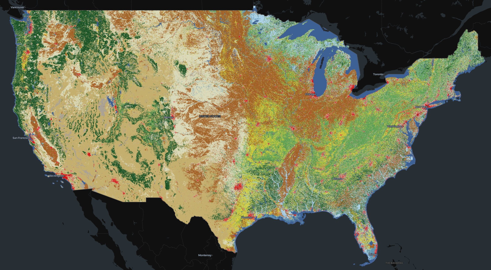
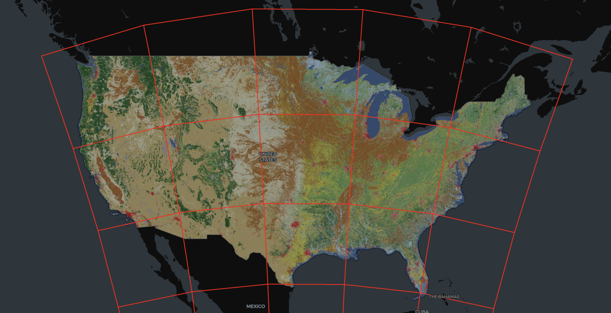

# @developmentseed/deck.gl-raster

GPU-accelerated [GeoTIFF][geotiff] and [Cloud-Optimized GeoTIFF][cogeo] (COG) visualization in [deck.gl].</br>
Client-side with direct image loading, no server required.

[geotiff]: https://en.wikipedia.org/wiki/GeoTIFF
[cogeo]: https://cogeo.org/
[deck.gl]: https://deck.gl/

[](https://developmentseed.org/deck.gl-raster/)

<p style="text-align: center;"><em><b>1.3GB</b> Land Cover COG rendered with <b>no server</b>.</em></p>

## Features

- Client-side GeoTIFF and Cloud-Optimized GeoTIFF visualization with no server required.
- GPU-based raster reprojection supports imagery from most projections [^1]
- Intelligent COG rendering, only fetching the relevant portions of the image required for the current view.
- Supports all GeoTIFFs defined by a linear geotransform (excludes those using Ground Control Points).
- Future: GPU-based color mapping and band math.

[^1]: The raster reprojection has not been tested on polar projections or when spanning the antimeridian.

## Packages

This monorepo contains the following packages, each of which are published to NPM:

### `@developmentseed/deck.gl-geotiff`

The high-level API for rendering GeoTIFFs and COGs in deck.gl.

#### `COGLayer`

A deck.gl layer for rendering a Cloud-Optimized GeoTIFF.

Internally, this uses a deck.gl [`TileLayer`] that matches the internal structure of the COG. When zoomed out, the COGLayer will automatically fetch the lowest-resolution overviews of the image. As you zoom in, deck.gl will automatically fetch and render tiles from the higher-resolution overviews of the image.

[`TileLayer`]: https://deck.gl/docs/api-reference/geo-layers/tile-layer

```ts
import { fromUrl } from "geotiff";
import { COGLayer } from "@developmentseed/deck.gl-geotiff";

const url = "https://example.com/my-cog.tif"
const geotiff = await fromUrl(url);

const deckLayer = new COGLayer({
    id: "cog-layer",
    geotiff,
});
```

This will work out of the box when the provided image is an RGB image. In particular, the COGLayer defaults to calling `geotiff.js`' `readRGB` method for each tile. To override how an RGB image is generated for display, pass in a custom handler to the `loadTexture` prop.

#### `GeoTIFFLayer`

In contrast to the COGLayer, this does not exploit the internal tiling of a COG. Instead, it will attempt to load the entire full-resolution image at once.


For now, this expects


: Deck.gl layer for rendering raster data from GeoTIFF and Zarr sources.



### `@developmentseed/deck.gl-raster`

There are two primary exports here: `RasterLayer` and `RasterTileset2D`.

_Blog post forthcoming_ to explain how this internal tiling here works.


#### `RasterLayer`

A generic deck.gl layer for rendering geospatial raster data from an arbitrary source.


<!-- export { RasterLayer } from "./raster-layer.js";
export type { RasterLayerProps } from "./raster-layer.js";
export { RasterTileset2D } from "./raster-tileset/index.js"; -->


### `@developmentseed/raster-reproject`

The primary export is `RasterReprojector`.

_Blog post forthcoming_ to explain how `RasterReprojector` works.

This has **no dependencies** and could maybe be used by other projects like Maplibre GL JS in the future.

## Installation

```bash
npm install @developmentseed/deck.gl-raster
```

## Usage

```typescript
import { RasterLayer } from '@developmentseed/deck.gl-raster';
import { Deck } from '@deck.gl/core';

const layer = new RasterLayer({
  id: 'raster-layer',
  data: 'https://example.com/data.tif',
  bounds: [-122.5, 37.7, -122.3, 37.9],
});

new Deck({
  initialViewState: {
    longitude: -122.4,
    latitude: 37.8,
    zoom: 11,
  },
  controller: true,
  layers: [layer],
});
```
