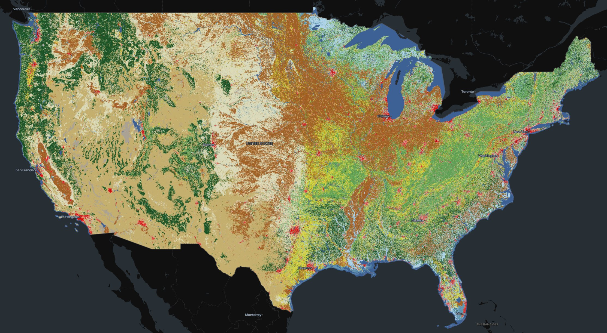
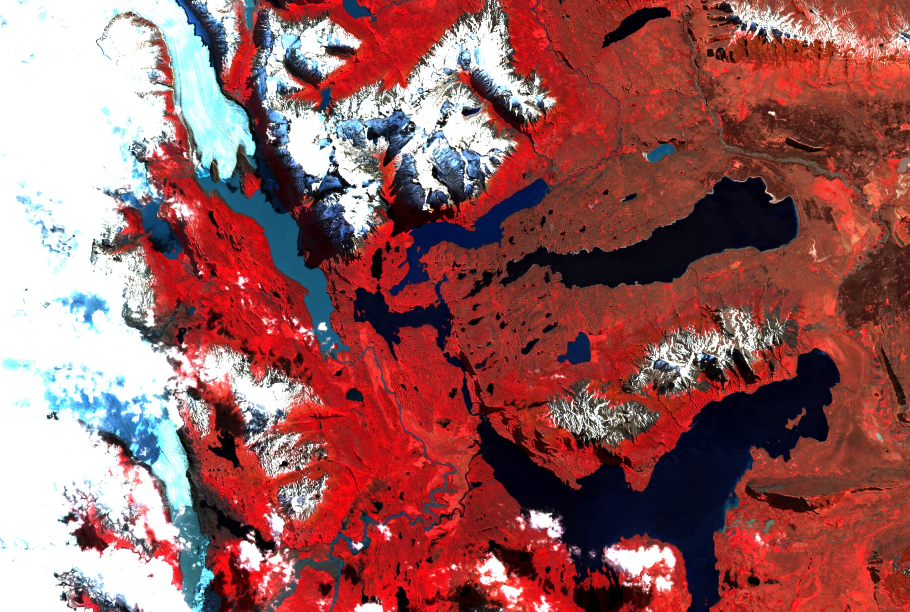
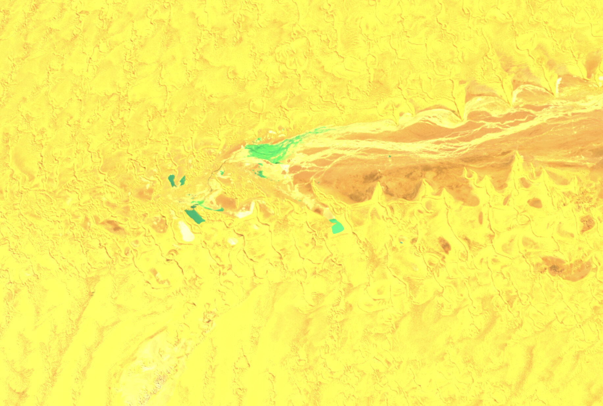

# deck.gl-raster

GPU-accelerated [GeoTIFF][geotiff], [Cloud-Optimized GeoTIFF][cogeo] (COG), and [Zarr] visualization in [deck.gl].

Fully client-side with direct image loading, no server required.

[**Documentation Website**](https://developmentseed.org/deck.gl-raster/)

[geotiff]: https://en.wikipedia.org/wiki/GeoTIFF
[cogeo]: https://cogeo.org/
[deck.gl]: https://deck.gl/
[Zarr]: https://zarr.dev/

<em><b>1.3GB</b> Land Cover COG rendered in the browser with <b>no server</b></em>: <a href="https://developmentseed.org/deck.gl-raster/examples/land-cover/">Live demo.</a>

[][sentinel-2-example]
Torres del Paine, Chile: Sentinel-2 Infrared False Color composite

[][sentinel-2-example]
Sossusvlei, Namibia: Sentinel-2 Agriculture composite

[sentinel-2-example]: https://developmentseed.org/deck.gl-raster/examples/sentinel-2/
