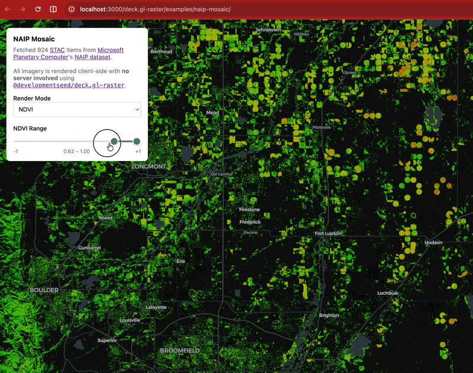
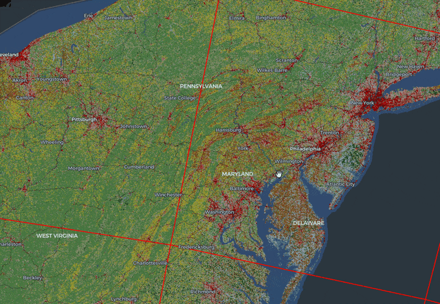
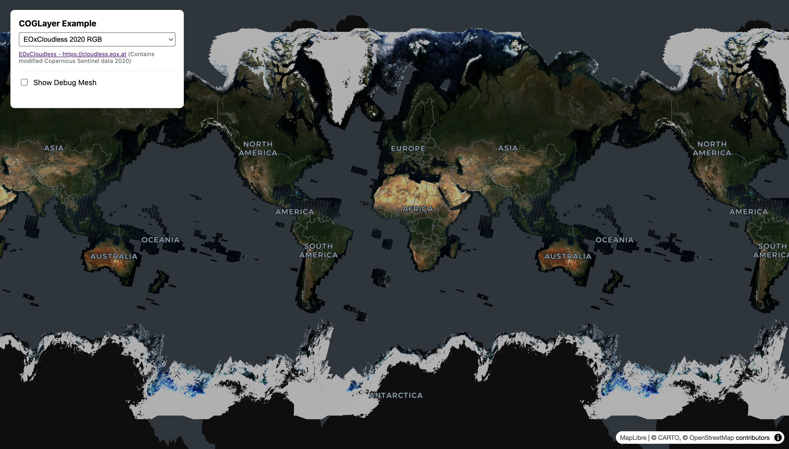

deck.gl-raster is enabling GPU-accelerated [GeoTIFF][geotiff] and [Cloud-Optimized GeoTIFF][cogeo] (COG) visualization in [deck.gl].

[geotiff]: https://en.wikipedia.org/wiki/GeoTIFF
[cogeo]: https://cogeo.org/
[deck.gl]: https://deck.gl/

Here's what's new in v0.4.

<!-- truncate -->

* feat: expose maxRequests on COGLayer by @maxrjones in https://github.com/developmentseed/deck.gl-raster/pull/333

## Updated Example: NDVI filtering on demand

Our [NAIP Mosaic example](https://developmentseed.org/deck.gl-raster/examples/naip-mosaic/) visualizes the [National Agriculture Imagery Program dataset] from [Microsoft Planetary Computer].

Since NAIP data contains a near-infrared band in addition to true-color red, green, and blue, we can render spectral indexes like [Normalized Difference Vegetation Index (NDVI)][ndvi].

[National Agriculture Imagery Program dataset]: https://planetarycomputer.microsoft.com/dataset/naip
[Microsoft Planetary Computer]: https://planetarycomputer.microsoft.com/
[ndvi]: https://www.earthdata.nasa.gov/topics/land-surface/normalized-difference-vegetation-index-ndvi

NDVI has a pretty simple formula:

$$
NDVI = \frac{NIR - Red}{NIR + Red}
$$

Since we have the raw values of the near-infrared and red bands in the browser, we can compute NDVI _on the GPU_ and then apply a colormap to convert the single value to an RGB color palette.

We've updated the example to also enable _GPU-based filtering_. Drag the slider to control what values of NDVI are displayed. This updates extremely fast because it's all on the GPU.

## Render coarser image data while loading finer data

Previously, when zooming in on a map, there would be a "blank" period: _after_ a parent, coarser image tile was no longer selected for display, but _before_ the child, finer image tile had successfully loaded over the network.

_Now_, we support the deck.gl [`refinementStrategy`] prop. This gives the user control for refining which tiles are visible while waiting for all tiles to load.

In this screenshot of the [NLCD Land Cover example](https://developmentseed.org/deck.gl-raster/examples/land-cover/), you can see the lower-resolution data is still rendered while waiting for the higher resolution data to load. (The red rectangular outlines are the boundaries of the COG tiles)

[`refinementStrategy`]: https://deck.gl/docs/api-reference/geo-layers/tile-layer#refinementstrategy

## Improved projection handling for viewing in Web Mercator

This release also improves rendering for images near the poles, especially for images stored in EPSG:4326 projection.

TODO: screenshot of better rendering near poles?

It should correctly render images that extend past the valid Web Mercator latitude range of $\pm 85.05\degree$. (Though in the Web Mercator view, such images will be clamped to the valid latitude range.)

This is mostly useful when viewing global imagery in EPSG:4326 projection, such as this screenshot of the [RGB GeoTIFF example](https://developmentseed.org/deck.gl-raster/examples/cog-basic/), selecting the image sample from [EOxCloudless](https://cloudless.eox.at/).

