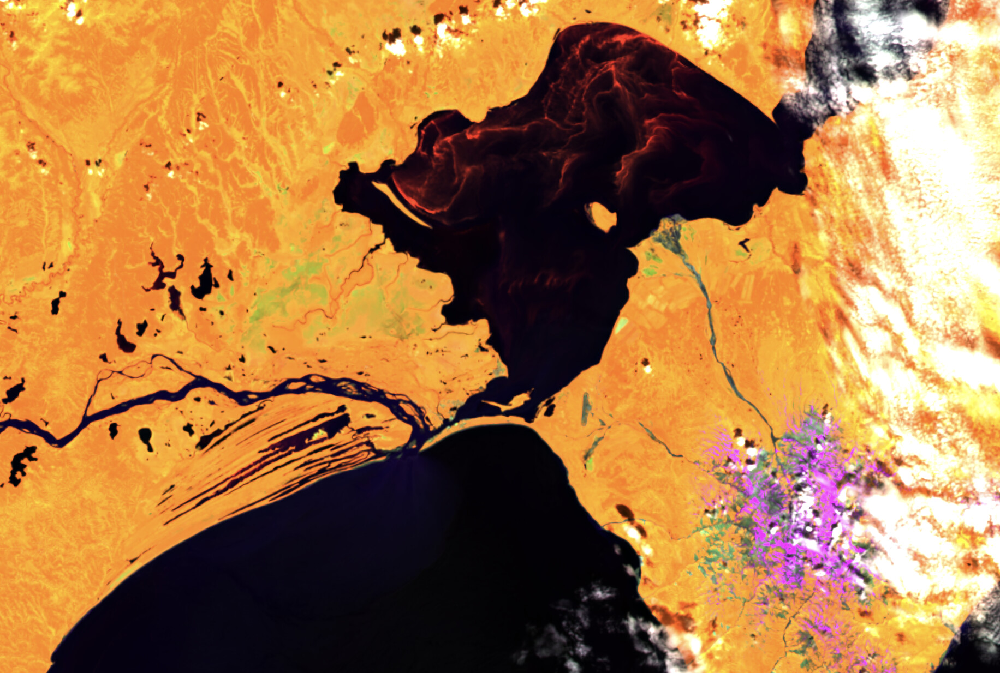
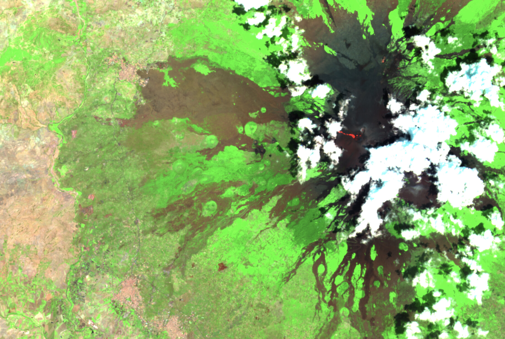
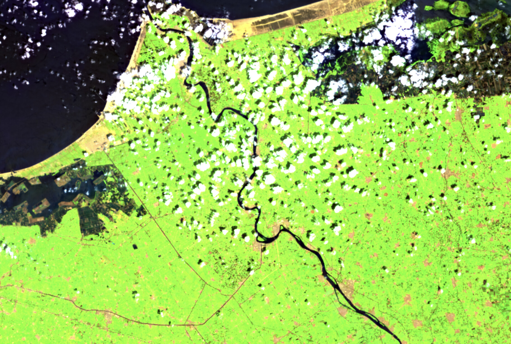
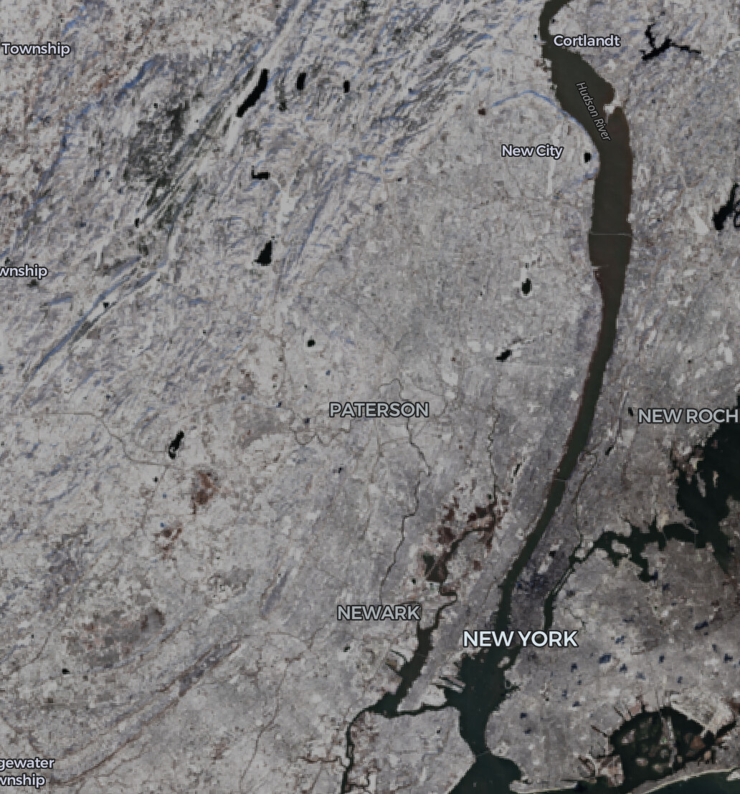
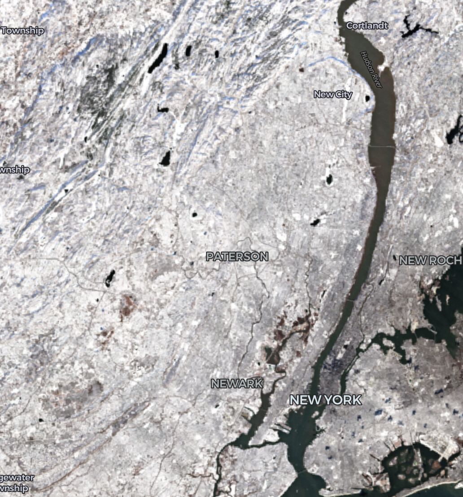

deck.gl-raster enables GPU-accelerated [GeoTIFF][geotiff] and [Cloud-Optimized GeoTIFF][cogeo] (COG) visualization in [deck.gl].

In v0.5 we have XXXXX new features.

[geotiff]: https://en.wikipedia.org/wiki/GeoTIFF
[cogeo]: https://cogeo.org/
[deck.gl]: https://deck.gl/

<!-- truncate -->

## Multi-band COG support

Many COGs are distributed as a collection of multiple inter-related files, where they all represent the same image.

For example, Sentinel-2 or Landsat images are distributed in open data buckets

https://registry.opendata.aws/sentinel-2-l2a-cogs/
https://registry.opendata.aws/usgs-landsat/

[][sentinel-2-example]
Torres del Paine, Chile: Infrared False Color composite

[][sentinel-2-example]
Sossusvlei, Namibia: Agriculture composite

[][sentinel-2-example]
Kamchatka, Russia: Vegetation composite

[][sentinel-2-example]
Mt Etna, Italy: SWIR composite

[][sentinel-2-example]
Nile Delta, Egypt: Agriculture composite

[sentinel-2-example]: https://developmentseed.org/deck.gl-raster/examples/sentinel-2/

## Fix "muted" colors

Previously we had unintentionally been "muting" colors. This is now fixed to default to rendering input colors as-is without any additional post-processing.

| Before                                      | After                                       |
| ------------------------------------------- | ------------------------------------------- |
|  |  |

This was happening because deck.gl applied a default [`Material`](https://deck.gl/docs/developer-guide/using-effects#material-settings) to renderings. This is useful for 3D visualizations, but in our case it makes more sense to turn the material off by default.

## Support deck.gl v9.3

In order to support the recent [deck.gl v9.3 release](https://deck.gl/docs/whats-new#deckgl-v93), we removed some previous workarounds around WebGL texture byte alignment. See [#419](https://github.com/developmentseed/deck.gl-raster/pull/419) for more information.

## Internal refactors for future Zarr & GeoZarr support

Previously, the internal "tile traversal" code, which tells deck.gl where to render each tile loaded from an image source, was tied to Cloud-Optimized GeoTIFFs and the [Tile Matrix Set specification](https://www.ogc.org/standards/tms).

We performed some [internal](https://github.com/developmentseed/deck.gl-raster/pull/391) [refactors](https://github.com/developmentseed/deck.gl-raster/pull/394) to generalize this interface. We now have an initial functional prototype of [GeoZarr](https://geozarr.org/) rendering, which will be properly released soon.
