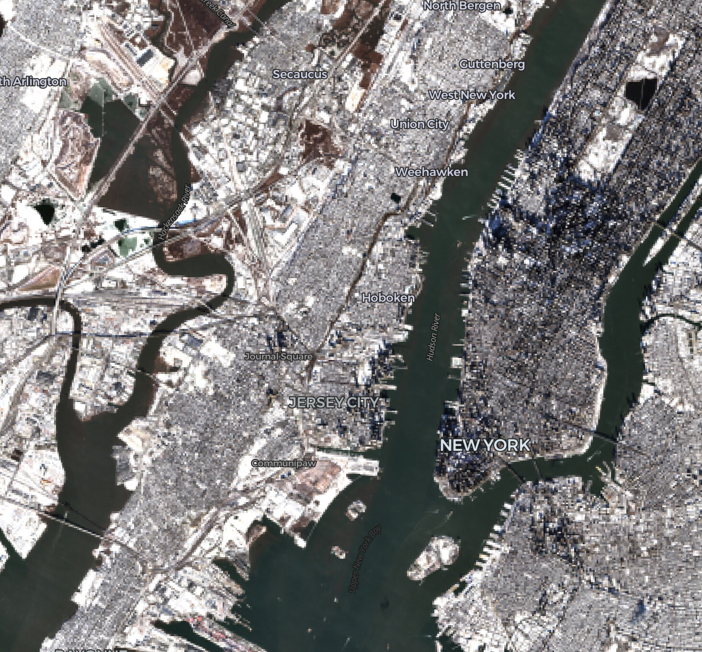
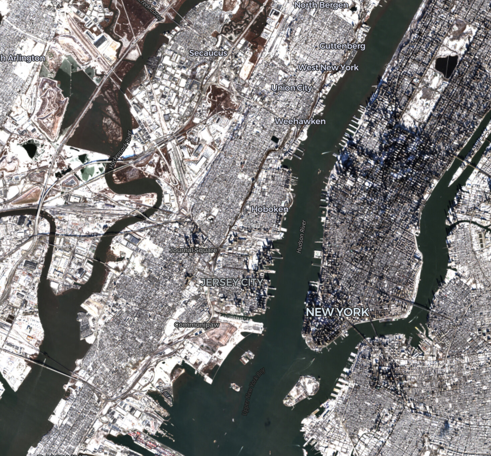

deck.gl-raster enables GPU-accelerated [Cloud-Optimized GeoTIFF][cogeo] (COG) and [Zarr] visualization in [deck.gl].

This release includes big performance improvements

[cogeo]: https://cogeo.org/
[Zarr]: https://zarr.dev/
[deck.gl]: https://deck.gl/

{/* truncate */}

## Performance improvements

### Big latency improvement for large COG

We've

https://github.com/developmentseed/deck.gl-raster/pull/529

* perf(geotiff)!: block-aligned LRU header cache; lazy tile metadata by @kylebarron in https://github.com/developmentseed/deck.gl-raster/pull/529

### Faster GPU updates for pixel filtering

Applies to both the COGLayer and the ZarrLayer.

See https://github.com/developmentseed/deck.gl-raster/pull/543 and https://github.com/developmentseed/deck.gl-raster/pull/540 for more details.

### Faster tile traversal

* fix(raster-tileset): memoize tile bounding volumes across traversals by @kylebarron in https://github.com/developmentseed/deck.gl-raster/pull/525

## Spiral image loading instead of top-left

We now load tiles starting from the center of the viewport.

_(Tile loading in this GIF was artificially slowed down for effect.)_

See https://github.com/developmentseed/deck.gl-raster/pull/477 for more details.

## Fixed tile selection on high-resolution displays

We now ensure that COG overview and Zarr multiscale selection matches the pixel density of your display. We **now render 4x as many pixels** on modern displays like Mac Retina displays.

Here are some before and after screenshots. Or go to our [NAIP example](https://developmentseed.org/deck.gl-raster/examples/naip-mosaic/) and notice how crisp the images are now.

| Before                                      | After                                      |
| ------------------------------------------- | ------------------------------------------ |
|  |  |
|   |   |

Previously we had been using the number of CSS pixels, which is not the same as the size of the GPU drawing buffer.

This means that for high-resolution screens like Mac Retina displays, **4x more image tiles** will now be loaded compared to before. We respect the [`Deck.useDevicePixels` parameter](https://deck.gl/docs/api-reference/core/deck#usedevicepixels), so you can turn that to `false` if you want to revert to the old behavior.

## Updated Examples

### Categorical land cover filtering

 Filterable categories

## New Example: Swipe comparsion of 200GB COGs

200GB COG

Vermont open data example

## MosaicLayer improvements

### Sources prop now reactive to changing input

     * List of mosaic sources to render.
     *
     * The mosaic updates reactively when this prop is replaced with a new
     * array reference. Mutating the array in place will not trigger an
     * update — pass a fresh array (e.g. `[...sources, newItem]`) to add or
     * remove items.
     *
     * Tile cache reuse depends on stable tile IDs. By default, each source's
     * tile ID is derived from its position in this array (see
     * `MosaicSource.key`), so:
     *
     * - Appending items preserves all existing rendered tiles.
     * - Reordering or removing items from the middle of the array invalidates
     *   the cache slots of shifted items, causing them to re-fetch.
     *
     * Supply an explicit `key` per source if you need cache stability across
     * arbitrary mutations of `sources`.
     */

### Caching improvements

Use the `id` attribute on each input source. in case you change the mosaic sources on the fly. This ensures that any existing layers are maintained across updates.
