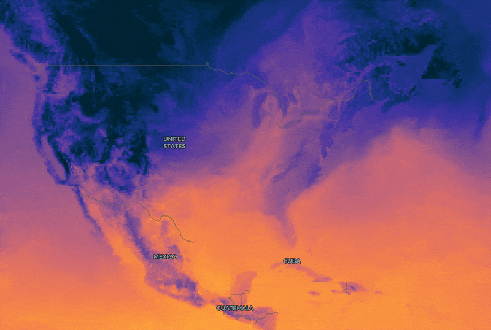

deck.gl-raster now supports rendering and animating [Zarr] and [GeoZarr] datasets in [deck.gl]. This is GPU-based and fully client-side, **without a server**. [See example][dynamical-example].

[][dynamical-example]

[Zarr]: https://zarr.dev/
[deck.gl]: https://deck.gl/
[GeoZarr]: https://geozarr.org/
[dynamical-example]: https://developmentseed.org/deck.gl-raster/examples/dynamical-zarr-ecmwf/

{/* truncate */}

## Initial GeoZarr support

We have two new modules, forming the building blocks of our support for Zarr:

- [`deck.gl-zarr`]: A high-level API for rendering [Zarr] datasets in deck.gl. The [`ZarrLayer`] connects to a deck.gl [`TileLayer`], ensuring that only chunks visible in the current map viewport will be loaded and rendered.
- [`geozarr`]: A helper library for parsing GeoZarr metadata. This is used inside of `deck.gl-zarr` and most users won't need to depend on this directly.

    For now, we assume that input Zarr datasets will contain GeoZarr metadata, but in the future, this will be extended to infer geospatial metadata where possible, such as from CF-conventions.

The `ZarrLayer` will **automatically** look for and use the [multiscales](https://github.com/zarr-conventions/multiscales) convention.

[`TileLayer`]: https://deck.gl/docs/api-reference/geo-layers/tile-layer
[Zarr]: https://zarr.dev/
[GeoZarr]: https://geozarr.org/
[`deck.gl-zarr`]: /api/deck-gl-zarr/
[`geozarr`]: /api/geozarr/
[`ZarrLayer`]: /api/deck-gl-zarr/classes/ZarrLayer/

`deck.gl-zarr` is designed around [Zarrita], the modern standard for Zarr on the web.

The `ZarrLayer` API may change a bit in the future. Feel free to provide feedback through issues or discussions.

[Zarrita]: https://zarrita.dev/

### Dimension management

Zarr data can have any number of dimensions. This makes it complex to visualize, where each spatial dimension ca

Currently, ZarrLayer requires the user to explicitly define a [Zarrita selection](https://zarrita.dev/slicing.html) for all non-spatial dimensions.

The ZarrLayer will inject the relevant selection for the two spatial dimensions depending on the chunks

In the future, we may also support chunking over non-spatial dimensions, see [#457].

[#457]: https://github.com/developmentseed/deck.gl-raster/issues/457

### Example: ECMWF temperature forecasts

### Example: AlphaEarth Foundations GeoZarr Mosaic

## Improved efficiency for colormap selection

deck.gl-raster applies colormaps on the GPU as a "lookup table". Think of a single color bar ranging from left to right.

With the _color-map_, we can _map_ numeric values from a range to a _color_. If our numeric range is, say, `[0 - 1]`, then assign `0` to the left side of the image and `1` to the right side of the image. Consequently a value of `0.5` would map to the middle of the colormap, and so on.

Performing a lookup is an efficient process on the GPU. But let's say you have an application where you don't know what color ramp the user might want to use.

A naive approach would be to manage all possible color ramps as different GPU resources. But since there are many possible colormaps, managing each one individually would require a bunch of limited GPU references.

Instead, we can use what are called [_sprites_](https://www.w3schools.com/css/css_image_sprites.asp). The general idea is: instead of representing many icons or images with many small, independent files, ship them all as **one single image**, alongside an index that keeps track of _which image part_ is in which pixel region.

This is what the improved `Colormap` GPU module supports.

The default colormap source now includes [_all Matplotlib's colormaps_][Matplotlib cmaps], compressed into a single 16KB image.

[Matplotlib cmaps]: https://matplotlib.org/stable/gallery/color/colormap_reference.html

This allows applications to seamlessly switch between colormaps on the fly, with no pausing or flashing. You can see this in the [ECMWF temperature example][dynamical-example] or the [NAIP mosaic example][naip-mosaic] (selecting NDVI mode).

[naip-mosaic]: https://developmentseed.org/deck.gl-raster/examples/naip-mosaic/

## New `RasterTileLayer`

We have a new [`RasterTileLayer`]() abstraction

* refactor: Create `RasterTileLayer` abstraction in `deck.gl-raster` package by @kylebarron in https://github.com/developmentseed/deck.gl-raster/pull/462

## Support for COGs with rotated or non-square pixels

* feat: Split COG tile traversal off TileMatrixSet by @kylebarron in https://github.com/developmentseed/deck.gl-raster/pull/480

## Performance improvements

* perf: Cull root tiles in raster-tileset to viewport by @kylebarron in https://github.com/developmentseed/deck.gl-raster/pull/464
* perf: Don't dynamic-import builtin deflate decoder by @kylebarron in https://github.com/developmentseed/deck.gl-raster/pull/483

## Future Work

Brainstorming and planning for how to support rendering generic Zarr and Xarray datasets through Lonboard in Python.

-----

Many COGs are distributed as a collection of multiple inter-related files, where they all represent the same scene with the same spatial extent. For example, [Sentinel-2][s2-aws-bucket] or [Landsat](https://registry.opendata.aws/usgs-landsat/) images are distributed in this type of COG layout.

We have a new [`MultiCOGLayer`] to support rendering this type of COG source. This layer is intended to be used whenever multiple separate COG files represent **one single composite image**. If you want to render multiple image sources as a mosaic, use the [`MosaicLayer`].

[s2-aws-bucket]: https://registry.opendata.aws/sentinel-2-l2a-cogs/
[`MultiCOGLayer`]: https://developmentseed.org/deck.gl-raster/api/deck-gl-geotiff/classes/MultiCOGLayer/
[`MosaicLayer`]: https://developmentseed.org/deck.gl-raster/api/deck-gl-geotiff/classes/MosaicLayer/

The `MultiCOGLayer` abstracts many technical implementation details away from the end user. When the source has bands at different resolutions, it will automatically resample across mixed band resolutions — _all on the GPU_.

For example, consider rendering a Sentinel-2 vegetation composite with the near-infrared, short-wave infrared, and red bands. The short-wave band's finest pixel resolution is 20 meters while the other bands have a finest pixel resolution of 10 meters. The `MultiCOGLayer` will _automatically upsample_ the short-wave infrared band up to 10m so that the three can be rendered together at full resolution.

We have a [new example application][sentinel-2-example] to visualize various selected Sentinel-2 scenes, directly from the [Sentinel-2 AWS Open Data bucket][s2-aws-bucket]. Below are screenshots from this example application.

[sentinel-2-example]: https://developmentseed.org/deck.gl-raster/examples/sentinel-2/
