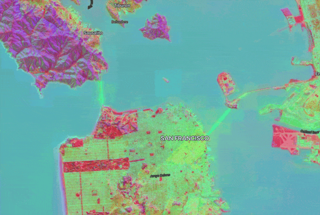

A new `ZarrLayer` now supports rendering and animating [Zarr] and [GeoZarr] datasets in [deck.gl]. This is GPU-based and fully client-side, **without a server**. [See example][dynamical-example].

[][dynamical-example]

[Zarr]: https://zarr.dev/
[deck.gl]: https://deck.gl/
[GeoZarr]: https://geozarr.org/
[dynamical-example]: https://developmentseed.org/deck.gl-raster/examples/dynamical-zarr-ecmwf/

{/* truncate */}

## Initial GeoZarr support

The new [`ZarrLayer`] manages loading and rendering data chunks from Zarr and GeoZarr data sources.

- The [`ZarrLayer`] connects to a deck.gl [`TileLayer`], ensuring that only chunks visible in the current map viewport will be loaded and rendered.
- The `ZarrLayer` will **automatically** look for and use any available [GeoZarr] conventions, including the [spatial](https://github.com/zarr-conventions/spatial), [multiscales](https://github.com/zarr-conventions/multiscales), and [geo-proj](https://github.com/zarr-conventions/geo-proj) conventions.

Our Zarr support is designed around [Zarrita], the modern standard for Zarr on the web.

We have two new public modules:

- [`deck.gl-zarr`]: Manages connection between deck.gl rendering and Zarr chunks.
- [`geozarr`]: A helper library for parsing GeoZarr metadata. This is used inside of `deck.gl-zarr` and most users won't need to depend on this directly.

    For now, we assume that input Zarr datasets will contain GeoZarr metadata, but in the future, this will be extended to infer geospatial metadata where possible, such as from CF-conventions.

[`TileLayer`]: https://deck.gl/docs/api-reference/geo-layers/tile-layer
[Zarr]: https://zarr.dev/
[GeoZarr]: https://geozarr.org/
[`deck.gl-zarr`]: /api/deck-gl-zarr/
[`geozarr`]: /api/geozarr/
[`ZarrLayer`]: /api/deck-gl-zarr/classes/ZarrLayer/

The `ZarrLayer` API may change a bit in the future. Feel free to provide feedback through issues or discussions.

[Zarrita]: https://zarrita.dev/

### Dimension management

Zarr data can have any number of dimensions. This makes it complex to visualize, since most visualization approaches require dimensionality reduction to 3 or 4 dimensions.

Currently, the `ZarrLayer` requires the user to explicitly define a [Zarrita selection](https://zarrita.dev/slicing.html) for all _non-spatial_ dimensions. Then, as the user pans around the map, the `ZarrLayer` will inject the relevant coordinates for the two spatial dimensions for each chunk requested in the current viewport.

In the future, we may also support chunking over non-spatial dimensions, see [#457].

[#457]: https://github.com/developmentseed/deck.gl-raster/issues/457

### [Example: ECMWF temperature forecasts][dynamical-example]

We have a [new example][dynamical-example] for visualizing temperature forecasts over time, using [ECMWF data](https://www.ecmwf.int/en/forecasts/datasets/open-data) hosted by [Dynamical](https://dynamical.org/catalog/ecmwf-ifs-ens-forecast-15-day-0-25-degree/).

Each Zarr chunk fetched to the browser contains a 15-day temperature forecast, allowing for animation over the time dimension.

Since the rescaling and colormaps are applied on the GPU, you can modify visualization parameters, _even while the animation is playing_.

[][dynamical-example]

This data source does not supply multiscales, so data may be slower to load as you zoom out.

### [Example: AlphaEarth Foundations Satellite Embeddings][aef-example]

We also have a [new example][aef-example] for visualizing Google's [AlphaEarth Foundations Satellite Embeddings](https://deepmind.google/blog/alphaearth-foundations-helps-map-our-planet-in-unprecedented-detail/).

This loads GeoZarr data directly from the [aef-mosaic bucket on Source Cooperative][aef-mosaic-source-coop].

Each embedding contains 64 bands per pixel. For now, our example app lets you choose three of them to render as RGB false color. In the future we may add support for other rendering approaches like cosine similarity to selected pixels. Have ideas? Let us know in an issue or discussion.

[aef-mosaic-source-coop]: https://source.coop/tge-labs/aef-mosaic
[aef-example]: https://developmentseed.org/deck.gl-raster/examples/aef-mosaic/

[][aef-example]

This data source does not supply multiscales, so data may be slower to load as you zoom out.

## Improved efficiency for colormap selection

The updated [`Colormap` GPU module] allows applications to **seamlessly switch between colormaps on the fly, with no pausing or flashing**. You can see this in the [ECMWF temperature example][dynamical-example] or the [NAIP mosaic example][naip-mosaic] (selecting NDVI mode).

[naip-mosaic]: https://developmentseed.org/deck.gl-raster/examples/naip-mosaic/
[`Colormap` GPU module]: /api/deck-gl-raster-gpu-modules/variables/Colormap/

deck.gl-raster applies colormaps on the GPU as a ["lookup table"](https://homepages.inf.ed.ac.uk/rbf/HIPR2/colmap.htm). Think of a single color bar ranging from left to right:

With the _color-map_, we can _map_ numeric values from a range to a _color_. If our numeric range is, say, `[0 - 1]`, then assign `0` to the left side of the image and `1` to the right side of the image. Consequently a value of `0.5` would map to the middle of the colormap, and so on.

Performing this lookup is a very efficient process on the GPU.

But let's say you have an application where you don't know what color ramp the user might want to use. A naive approach would be to manage all possible color ramps as different GPU resources. But this would be inefficient given the number of colormaps users might want to choose from.

Instead, we can use the concept of [_sprites_](https://www.w3schools.com/css/css_image_sprites.asp). The general idea is: instead of representing many icons or images with many small, independent files, ship them all as **one single image**, alongside an index that keeps track of _which image part_ is in which pixel region.

This is what the improved [`Colormap` GPU module] supports. The default colormap image now includes [_all Matplotlib's colormaps_][Matplotlib cmaps], compressed into a single 16KB image:

[Matplotlib cmaps]: https://matplotlib.org/stable/gallery/color/colormap_reference.html

Then the module automatically manages which bar to read from when applying the lookup table.

## New `RasterTileLayer` for rendering tiled raster data from _any source_

We have a new [`RasterTileLayer`] abstraction that underlies both the [`COGLayer`] and the [`ZarrLayer`]. Besides cleaner internal architecture, this allows for applications to render image data from _any tiled source_ without being tied to COG or Zarr.

[`COGLayer`]: /api/deck-gl-geotiff/classes/COGLayer/
[`RasterTileLayer`]: /api/deck-gl-raster/classes/RasterTileLayer/

Essentially, `COGLayer` and `ZarrLayer` are now just small shims on top of the `RasterTileLayer` to manage COG and Zarr semantics for loading data chunks.

For example, Lonboard [uses this layer](https://github.com/developmentseed/lonboard/blob/746092728c95510a0ee5c3ac6517e2b8f1c193b3/src/model/layer/raster.ts#L165-L177) to provide chunked image data on demand that is loaded by Python-based COG and Zarr readers.

We also have a [work-in-progress demo](https://github.com/developmentseed/deck.gl-raster/pull/469) that uses this layer to load image tiles from a backend [titiler](https://github.com/developmentseed/titiler) instance.

## Support for COGs with rotated or non-square pixels

[#480](https://github.com/developmentseed/deck.gl-raster/issues/480) changed the internal tile grid representation for COGs to not use OGC TileMatrixSets.

This ensures that we can accurately render COGs with a rotated affine transform ([#327](https://github.com/developmentseed/deck.gl-raster/issues/327)) or with non-square pixels ([#375](https://github.com/developmentseed/deck.gl-raster/issues/375)).

## Future Work

We're brainstorming the architecture for supporting visualization of generic Zarr and Xarray datasets through [Lonboard](https://github.com/developmentseed/lonboard).
