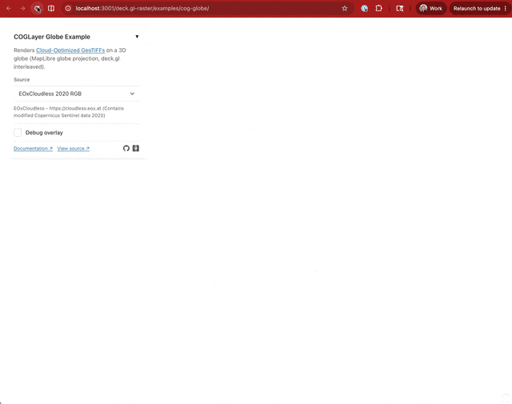
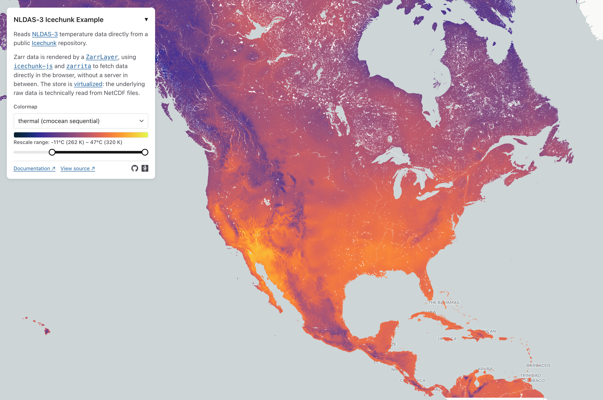
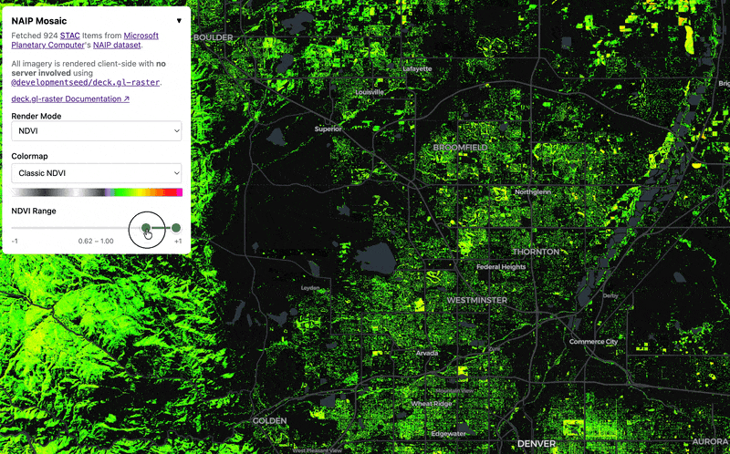
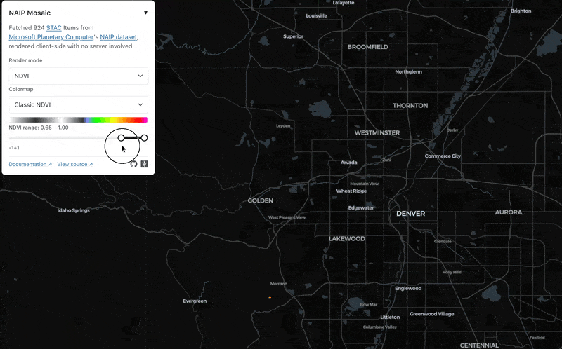
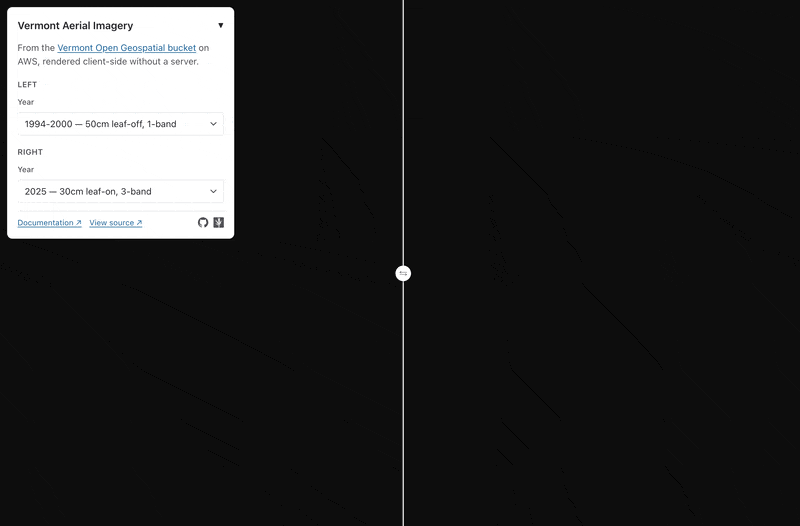
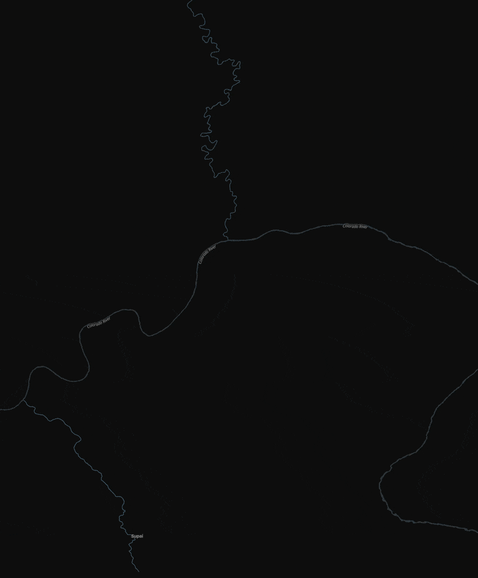
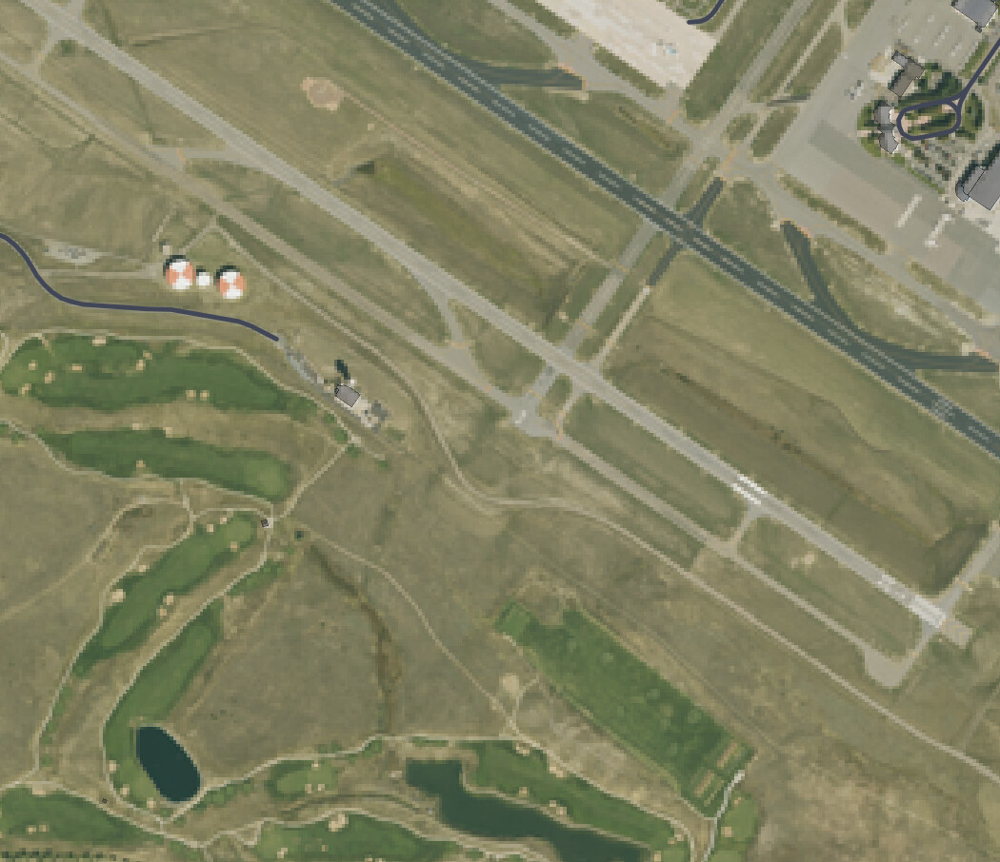
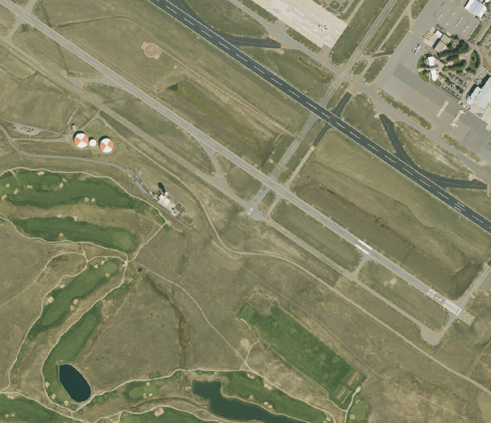
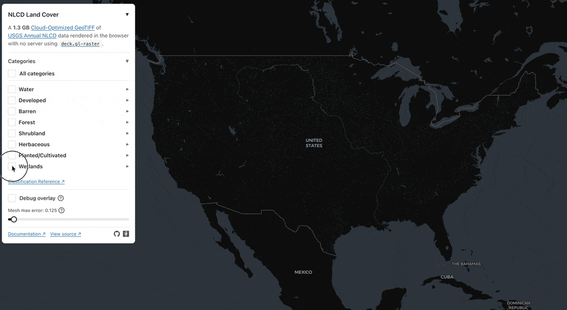
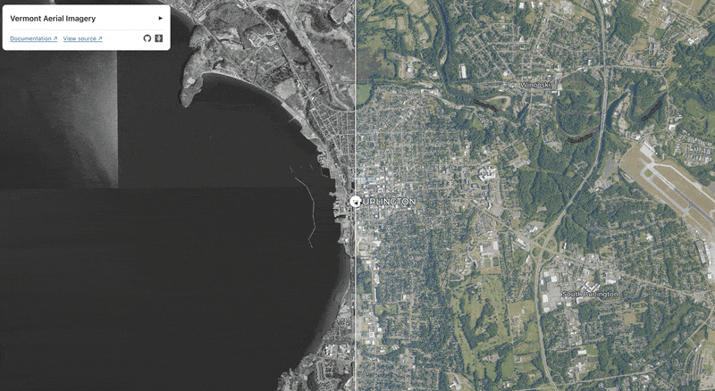

deck.gl-raster enables GPU-accelerated [Cloud-Optimized GeoTIFF][cogeo] (COG) and [Zarr] visualization in [deck.gl].

This release includes big performance improvements, tile loading that spirals from the center, fixed tile resolution selection for high pixel density displays, and updated examples.

[cogeo]: https://cogeo.org/
[Zarr]: https://zarr.dev/
[deck.gl]: https://deck.gl/

{/* truncate */}

## Traverse across world copies

* fix: traverse tiles across world copies (#517) by @kylebarron in https://github.com/developmentseed/deck.gl-raster/pull/518

## Fix jitter at high zooms

* fix: Use fp64 emulation to fix lack of precision (jitter) at high zooms by @kylebarron in https://github.com/developmentseed/deck.gl-raster/pull/559

## Improved request cancellation for mosaic layer

* feat: per-origin HTTP concurrency limiter for COG layers by @kylebarron in https://github.com/developmentseed/deck.gl-raster/pull/557
* fix(geotiff): revert ConcurrencyLimiter to a chunkd SourceMiddleware by @kylebarron in https://github.com/developmentseed/deck.gl-raster/pull/572

## Fixed projection for datasets whose bounds reach to +-90 degrees

* feat: reprojector initial-triangulation seed + clamp Web Mercator meshes to ±85.051° by @kylebarron in https://github.com/developmentseed/deck.gl-raster/pull/574
* fix: clamp Web Mercator mesh for south-up affines by @kylebarron in https://github.com/developmentseed/deck.gl-raster/pull/590

## Preliminary GlobeView support

We've landed preliminary support for deck.gl's [`GlobeView`].

**Some projections may render with some distortion**. This initial support takes a simpler rendering approach, using a fixed number of resampling points, instead of the more accurate dynamic resampling approach used in the standard Web Mercator [`MapView`].

[`GlobeView`]: https://deck.gl/docs/api-reference/core/globe-view
[`MapView`]: https://deck.gl/docs/api-reference/core/map-view

See [#563](https://github.com/developmentseed/deck.gl-raster/pull/563) for the existing implementation and follow [#578](https://github.com/developmentseed/deck.gl-raster/pull/578) for the improved reprojection work.

## Icechunk example

We created a new [Icechunk](https://icechunk.io/en/stable/)-based [example][nldas-icechunk-example] with the `ZarrLayer`. It reads [NLDAS-3](https://ldas.gsfc.nasa.gov/nldas/v3) temperature data directly from a public Icechunk repository.

This dataset is [virtualized](https://github.com/zarr-developers/VirtualiZarr)! All tile data requests are being made into _NetCDF_ data files.

[nldas-icechunk-example]: https://developmentseed.org/deck.gl-raster/examples/nldas-icechunk/

[][nldas-icechunk-example]

See [#577](https://github.com/developmentseed/deck.gl-raster/pull/577) for more info.

## Fixed GPU memory leak for COGLayer and ZarrLayer

We fixed a GPU memory leak in tiled layers with default rendering.

If you're defining your own `getTileData` that manually creates luma.gl `Texture` objects, make sure you also define `onTileUnload` which calls `Texture.destroy()`.

See [#591](https://github.com/developmentseed/deck.gl-raster/pull/591) for more info.

We've significantly improved the performance of GPU updates for things like pixel filtering and rescaling. This screencast compares NDVI range pixel filtering in the [NAIP mosaic example](https://developmentseed.org/deck.gl-raster/examples/naip-mosaic/):

**Before:**

**After:**

This improved performance applies to both the [COGLayer](https://developmentseed.org/deck.gl-raster/api/deck-gl-geotiff/classes/COGLayer/) and the [ZarrLayer](https://developmentseed.org/deck.gl-raster/api/deck-gl-zarr/classes/ZarrLayer/).

See [#543](https://github.com/developmentseed/deck.gl-raster/pull/543) and [#540](https://github.com/developmentseed/deck.gl-raster/pull/540) for more details.

### Big latency improvement for large COGs

We've updated [our GeoTIFF reader](https://developmentseed.org/deck.gl-raster/api/geotiff/) to reduce the number of header requests required to start rendering a COG.

In our [Vermont Aerial Imagery example](https://developmentseed.org/deck.gl-raster/examples/vermont-cog-comparison/), for a **200 gigabyte COG**, we fetch only **256 kilobytes** of metadata before starting to load image tiles.

This screencast from that example simulates loading a 200GB COG (on the right) and a 50GB COG (on the left) over a 20MB/s internet connection with caching disabled:

See [#529](https://github.com/developmentseed/deck.gl-raster/pull/529) for more information.

## Spiral image loading instead of top-left

We now load tiles starting from the center of the viewport.

_(Tile loading in this screencast was artificially slowed down for effect.)_

See [#477](https://github.com/developmentseed/deck.gl-raster/pull/477) for more details.

## "Retina" display support

We now ensure that COG overview and Zarr multiscale tile selection matches the pixel density of your display. We **now render 4x as many pixels** on modern displays like Mac Retina displays.

Here's a comparison from our [NAIP example](https://developmentseed.org/deck.gl-raster/examples/naip-mosaic/). Notice how much more crisp the image is now.

**Before:**

**After:**

Previously we had been using the number of CSS pixels, which is not the same as the size of the GPU drawing buffer.

This means that for high-resolution screens like Mac Retina displays, **4x more image tiles** will now be loaded compared to before. We respect the [`Deck.useDevicePixels` parameter](https://deck.gl/docs/api-reference/core/deck#usedevicepixels), so you can turn that to `false` if you want to revert to the old behavior.

See [#513](https://github.com/developmentseed/deck.gl-raster/pull/513) for more details.

## Updated Examples

### Categorical land cover filtering

We've updated the existing [NLCD Land Cover example](https://developmentseed.org/deck.gl-raster/examples/land-cover/) to filter pixels by their classification. All pixel filtering happens on the fly on the GPU.

See [#506](https://github.com/developmentseed/deck.gl-raster/pull/506) for more details.

### Side-by-side image comparsion

As alluded to in our [performance section above](#big-latency-improvement-for-large-cogs), we have [a new example](https://developmentseed.org/deck.gl-raster/examples/vermont-cog-comparison/) that shows one method for "left/right image comparisons" with deck.gl-raster.

See [#502](https://github.com/developmentseed/deck.gl-raster/pull/502) for more details.

## MosaicLayer improvements

The [`MosaicLayer`](https://developmentseed.org/deck.gl-raster/api/deck-gl-geotiff/classes/MosaicLayer/) is a layer designed to help with rendering many COG images on the map. It's used in the [NAIP mosaic example](https://developmentseed.org/deck.gl-raster/examples/naip-mosaic/) to render many COgs in a grid.

### Sources prop now reactive to changing input

The MosaicLayer now updates reactively when the [`sources`](https://developmentseed.org/deck.gl-raster/api/deck-gl-geotiff/type-aliases/MosaicLayerProps/#sources) prop is replaced with a new array reference. This allows you to update the mosaic sources in response to new data or as the user pans around the map.

### Caching improvements

If you change the `sources` prop after layer creation, ensure you set the `id` attribute on each input source. This ensures cache stability across arbitrary new `sources` arrays.
