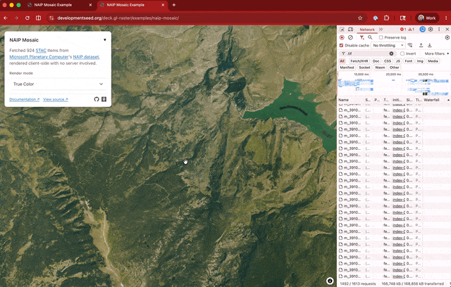
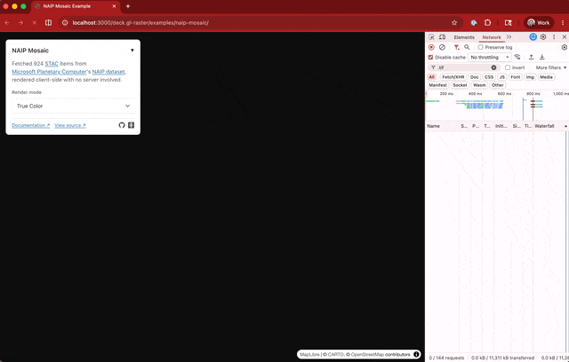
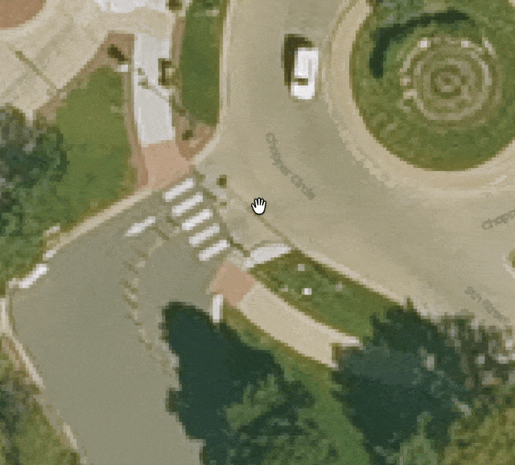
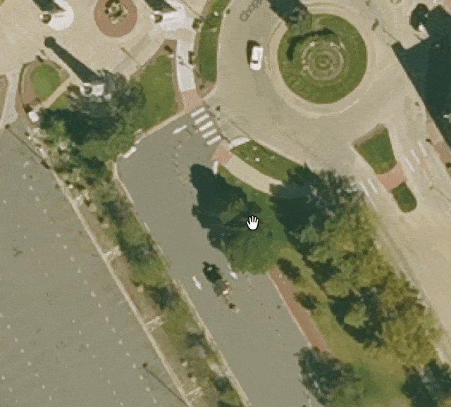
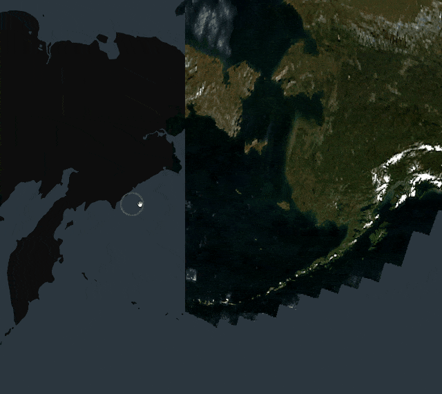
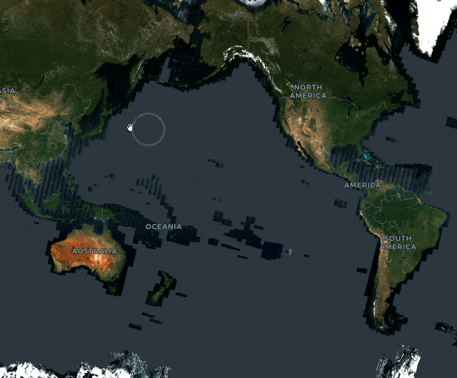

deck.gl-raster enables GPU-accelerated [Cloud-Optimized GeoTIFF][cogeo] (COG) and [Zarr] visualization in [deck.gl].

TODO

This release includes big performance improvements, tile loading that spirals from the center, fixed tile resolution selection for high pixel density displays, and updated examples.

[cogeo]: https://cogeo.org/
[Zarr]: https://zarr.dev/
[deck.gl]: https://deck.gl/

{/* truncate */}

## Preliminary GlobeView support

We've landed preliminary support for deck.gl's [`GlobeView`].

**Some projections may render with some distortion**. This initial implementation takes a simpler rendering approach, using a fixed number of resampling points, instead of the more accurate dynamic resampling approach used in the standard Web Mercator [`MapView`].

[`GlobeView`]: https://deck.gl/docs/api-reference/core/globe-view
[`MapView`]: https://deck.gl/docs/api-reference/core/map-view

See [#563](https://github.com/developmentseed/deck.gl-raster/pull/563) for the existing implementation and follow [#578](https://github.com/developmentseed/deck.gl-raster/pull/578) for the improved reprojection work.

## Improved request performance for mosaic layer

Previously, scrolling around the map quickly would generate many, many requests of images that were only briefly in view and that aren't cancelled when panning around the map.

**Before**: we fetch almost 300MB of data before loading the data in the end viewport location. It takes so long to load the data because it keeps loading off-screen tiles.

_Note: the gif is 30 seconds long. It may look stuck, but pay attention to the download gauge in the bottom right counting upwards, representing off-screen requests._

**After**, the request cancellation is working much better. As we scroll around the map, off-screen tiles are immediately cancelled, so the latency of loading new tiles is vastly reduced.

See [#557](https://github.com/developmentseed/deck.gl-raster/pull/557) for more info.

## Fixed projection for datasets whose bounds reach to +-90 degrees

* feat: reprojector initial-triangulation seed + clamp Web Mercator meshes to ±85.051° by @kylebarron in https://github.com/developmentseed/deck.gl-raster/pull/574
* fix: clamp Web Mercator mesh for south-up affines by @kylebarron in https://github.com/developmentseed/deck.gl-raster/pull/590

## Icechunk example

We created a new [Icechunk](https://icechunk.io/en/stable/)-based [example][nldas-icechunk-example] with the `ZarrLayer`. It reads [NLDAS-3](https://ldas.gsfc.nasa.gov/nldas/v3) temperature data directly from a public Icechunk repository.

This dataset is [virtualized](https://github.com/zarr-developers/VirtualiZarr)! All tile data requests are being made into _NetCDF_ data files.

[nldas-icechunk-example]: https://developmentseed.org/deck.gl-raster/examples/nldas-icechunk/

[][nldas-icechunk-example]

See [#577](https://github.com/developmentseed/deck.gl-raster/pull/577) for more info.

## Fix image jitter at high zooms

Previously, viewing a high-resolution raster dataset — like in the NAIP example, which has 30-centimeter resolution — the image would noticeably _jitter_ around the screen when zoomed in at high resolution.

[NAIP example]: https://developmentseed.org/deck.gl-raster/examples/naip-mosaic/

This was because the GPU used float32 positions to locate the image on the map, and float32 wasn't enough precision to precisely position the image. The jitter came from switching between float32 units of least precision on either side of the actual float64 value.

Though GPUs only natively support 32-bit floats, we fixed this by using emulated float64 values. Because of how the rendering works, this only causes a tiny amount of overhead.

**Before**:

**After**, we now smoothly zoom in and out at high zooms:

See [#559](https://github.com/developmentseed/deck.gl-raster/pull/559) for more info.

## Fix rendering across multiple "world copies"

When you're viewing a map over the antimeridian, deck.gl is actually rendering _two copies_ of the map: one for the world on the left side of the antimeridian and another for the world on the right side.

**Before**, we didn't render image data into both maps:

**After**, we now seamlessly render on both sides of the antimeridian.

This is **separate** from being able to render images that themselves _cross_ the antimeridian. In the above screencasts, the example COG has bounds from `[-180, 180]`, so it's on either side of the antimeridian but doesn't cross it.

See [#518](https://github.com/developmentseed/deck.gl-raster/pull/518) for more info.

## Fixed GPU memory leak for COGLayer and ZarrLayer

We fixed a GPU memory leak in tiled layers with default rendering.

If you're defining your own `getTileData` that manually creates luma.gl `Texture` objects, make sure you also define `onTileUnload` which calls `Texture.destroy()`.

See [#591](https://github.com/developmentseed/deck.gl-raster/pull/591) for more info.
